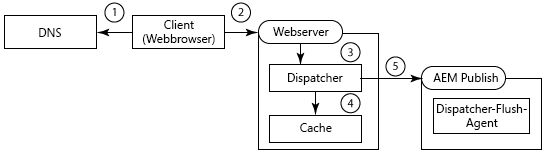
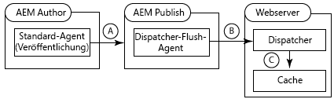
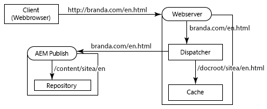
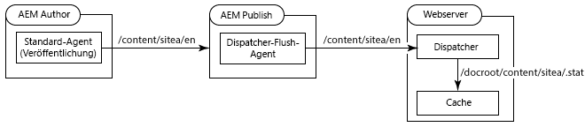
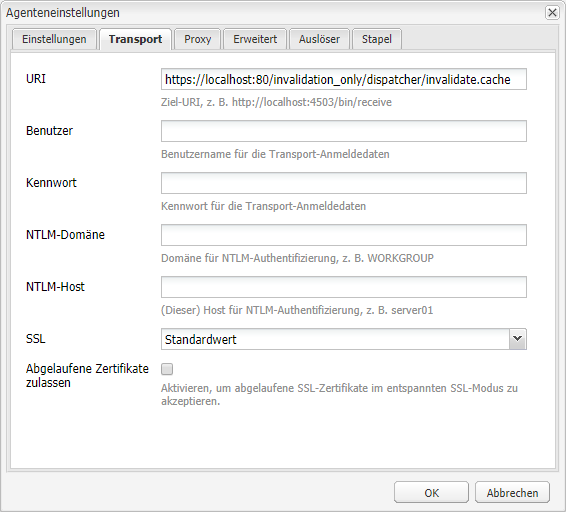
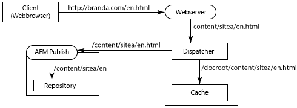
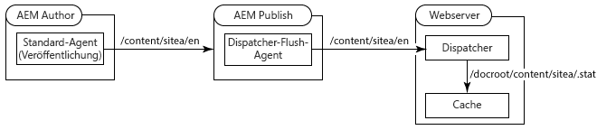
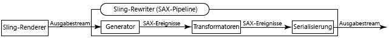
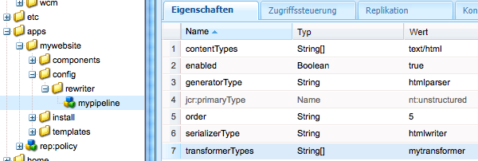

# Verwenden des Dispatchers mit mehreren Domänen {#using-dispatcher-with-multiple-domains}

>[!NOTE]
>
>Dispatcher-Versionen sind unabhängig von AEM. Möglicherweise wurden Sie von der Dokumentation zu AEM oder CQ zu dieser Seite weitergeleitet.

Verwenden Sie den Dispatcher, um Seitenanforderungen in mehreren Webdomänen zu verarbeiten und gleichzeitig die folgenden Bedingungen zu erfüllen:

* Webinhalt für beide Domänen wird in einem einzelnen AEM-Repository gespeichert.
* Die Dateien im Dispatcher-Cache können getrennt für jede Domäne ungültig gemacht werden.

Beispiel: Ein Unternehmen veröffentlicht Websites für zwei seiner Marken – Marke A (Brand A) und Marke B (Brand B). Der Inhalt für die Seiten der Websites wird in AEM erstellt und im selben Repository-Arbeitsbereich gespeichert:

```
/
| - content  
   | - sitea  
       | - content nodes  
   | - siteb  
       | - content nodes
```

Seiten für `BrandA.com` werden unter `/content/sitea` gespeichert. Bei Clientanfragen für die URL `https://BrandA.com/en.html` wird die gerenderte Seite für den `/content/sitea/en`-Knoten zurückgegeben. Entsprechend werden Seiten für `BrandB.com` unter `/content/siteb` gespeichert.

Bei Verwendung des Dispatchers zum Speichern von Inhalt im Cache müssen Zuordnungen zwischen der URL in der Client-HTTP-Anforderung, dem Pfad der entsprechenden Datei im Cache und dem Pfad der entsprechenden Datei im Repository erstellt werden.

## Clientanforderungen

Wenn Clients HTTP-Anforderungen an den Webserver senden, muss die URL der angeforderten Seite zum Inhalt im Dispatcher-Cache und schließlich zum Inhalt im Repository aufgelöst werden.



1. Das Domain Name System erkennt die IP-Adresse des Webservers, der für den Domänennamen in der HTTP-Anforderung registriert ist.
1. Die HTTP-Anforderung wird an den Webserver gesendet.
1. Die HTTP-Anforderung wird an den Dispatcher übergeben.
1. Der Dispatcher ermittelt, ob die Cachedateien gültig sind. Wenn sie gültig sind, werden die zwischengespeicherten Dateien für den Client bereitgestellt.
1. Falls die zwischengespeicherten Dateien nicht gültig sind, fordert der Dispatcher neu gerenderte Seiten von der AEM-Veröffentlichungsinstanz an.

## Cache-Invalidierung

Wenn Dispatcher Flush-Replikationsagenten anfordern, dass der Dispatcher zwischengespeicherte Dateien ungültig macht, muss der Pfad des Inhalts im Repository zum Inhalt im Cache aufgelöst werden.



1. Eine Seite wird auf der AEM-Autoreninstanz aktiviert und der Inhalt wird an die Veröffentlichungsinstanz repliziert.
1. Der Dispatcher Flush-Agent ruft den Dispatcher zur Invalidierung des Caches für den replizierten Inhalt auf.
1. Der Dispatcher nimmt nicht inhaltsverändernde Bearbeitungen an einer oder mehreren STAT-Dateien vor, um die zwischengespeicherten Dateien ungültig zu machen.

Um den Dispatcher mit mehreren Domänen zu verwenden, müssen Sie AEM, den Dispatcher und Ihren Webserver konfigurieren. Bei den auf dieser Seite beschriebenen Lösungen handelt es sich um allgemeine Lösungen, die sich für die meisten Umgebungen eignen. Aufgrund der Komplexität einiger AEM-Topologien erfordert Ihre Lösung möglicherweise weitere benutzerdefinierte Konfigurationen, um bestimmte Probleme zu beheben. Sie müssen die Beispiele ggf. gemäß den Anforderungen Ihrer vorhandenen IT-Infrastruktur und Verwaltungsrichtlinien anpassen.

## URL-Zuordnung {#url-mapping}

Um für Domänen-URLs und Inhaltspfade die Auflösung zu zwischengespeicherten Dateien zu ermöglichen, muss an einem Punkt während des Prozesses ein Dateipfad oder eine Seiten-URL übersetzt werden. Es werden Beschreibungen der folgenden allgemeinen Strategien bereitgestellt, bei denen Pfad- oder URL-Übersetzungen an unterschiedlichen Punkten während des Prozesses erfolgen:

* (Empfohlen) Die AEM-Veröffentlichungsinstanz verwendet die Sling-Zuordnung für die Ressourcenauflösung zur Implementierung von Regeln zum Neuschreiben interner URLs. Domänen-URLs werden in Inhaltsrepositorypfade übersetzt. (Siehe [AEM schreibt eingehende URLs neu](#aem-rewrites-incoming-urls).)
* Der Webserver verwendet Regeln zum Neuschreiben interner URLs, die Domänen-URLs in Cachepfade übersetzen. (Siehe [Der Webserver schreibt eingehende URLs neu](#the-web-server-rewrites-incoming-urls))

Es empfiehlt sich, kurze URLs für Webseiten zu verwenden. Üblicherweise spiegeln Seiten-URLs die Struktur der Repositoryordner wider, die den Webinhalt enthalten. Allerdings zeigen die URLs nicht die höchsten Repositoryknoten, beispielsweise `/content`. Dem Client ist die Struktur des AEM-Repositorys nicht notwendigerweise bekannt.

## Allgemeine Anforderungen {#general-requirements}

In Ihrer Umgebung müssen die folgenden Konfigurationen implementiert werden, um die Verwendung des Dispatchers mit mehreren Domänen zu unterstützen:

* Der Inhalt für jede Domäne befindet sich in getrennten Verzweigungen des Repositorys (siehe die im Folgenden aufgeführte Beispielumgebung).
* Der Dispatcher Flush-Replikationsagent wird auf der AEM-Veröffentlichungsinstanz konfiguriert. (Siehe [Invalidierung des Dispatcher-Caches von einer Veröffentlichungsinstanz ](page-invalidate.md))
* Das Domänennamensystem löst die Domänennamen zu der IP-Adresse des Webservers auf.
* Der Dispatcher-Cache spiegelt die Verzeichnisstruktur des AEM-Inhaltsrepository wider. Die Dateipfade unter dem Dokumentenstamm des Webservers stimmen mit den Pfaden der Dateien im Repository überein.

## Umgebung für die aufgeführten Beispiele  {#environment-for-the-provided-examples}

Die aufgeführten Beispiellösungen gelten für Umgebungen mit den folgenden Eigenschaften:

* Die AEM-Autoren- und Veröffentlichungsinstanzen werden auf Linux-Systemen bereitgestellt.
* Apache HTTPD ist der auf einem Linux-System bereitgestellte Webserver.
* Das AEM-Inhaltsrepository und das Basisverzeichnis des Webservers verwenden die folgenden Dateistrukturen (das Basisverzeichnis des Apache-Webservers lautet /`usr/lib/apache/httpd-2.4.3/htdocs)`):

   **Repository**

```
  | - /content  
    | - sitea  
  |    | - content nodes 
    | - siteb  
       | - conent nodes
```

**Dokumentenstamm des Webservers**

```
  | - /usr  
    | - lib  
      | - apache  
        | - httpd-2.4.3  
          | - htdocs  
            | - content  
              | - sitea  
                 | - content nodes 
              | - siteb  
                 | - content nodes
```

## AEM schreibt eingehende URLs neu {#aem-rewrites-incoming-urls}

Die Sling-Zuordnung für die Ressourcenauflösung ermöglicht es Ihnen, eingehende URLs AEM-Inhaltspfaden zuzuordnen. Erstellen Sie Zuordnungen auf der AEM-Veröffentlichungsinstanz, sodass Renderanforderungen des Dispatchers zum richtigen Inhalt im Repository aufgelöst werden.

Dispatcher-Anforderungen für das Rendern von Seiten identifizieren die Seite mithilfe der URL, die vom Webserver übergeben wurde. Wenn die URL einen Domänennamen enthält, lösen Sling-Zuordnungen die URL zum Inhalt auf. Die folgende Abbildung zeigt die Zuordnung der `branda.com/en.html`-URL zum `/content/sitea/en`-Knoten.



Der Dispatcher-Cache spiegelt die Repositoryknotenstruktur wider. Aus diesem Grund erfordern die resultierenden Anfragen zur Invalidierung der zwischengespeicherten Seite bei Seitenaktivierungen keine URL- oder Pfadübersetzungen.



## Definieren virtueller Hosts auf dem Webserver {#define-virtual-hosts-on-the-web-server}

Definieren Sie virtuelle Hosts auf dem Webserver, sodass jeder Webdomäne ein anderer Dokumentenstamm zugewiesen werden kann:

* Der Webserver muss eine virtuelle Domäne für jede Ihrer Webdomänen definieren.
* Konfigurieren Sie für jede Domäne das Basisverzeichnis zum Ordner im Repository mit dem Webinhalt der Domäne.
* Jede virtuelle Domäne muss außerdem Dispatcher-bezogene Konfigurationen umfassen, wie auf der Seite [Installieren des Dispatchers](dispatcher-install.md) beschrieben.

Die folgende Beispieldatei `httpd.conf` konfiguriert zwei virtuelle Domänen für einen Apache-Webserver:

* Die Servernamen (die mit den Domänennamen übereinstimmen) lauten „branda.com“ (Zeile 16) und „brandB.com“ (Zeile 30).
* Der Dokumentenstamm der einzelnen virtuellen Domänen ist das Verzeichnis im Dispatcher-Cache, das die Seiten der Website enthält. (Zeile 17 und 31)

Mit dieser Konfiguration führt der Webserver die folgenden Aktionen durch, wenn er eine Anforderung für `https://branda.com/en/products.html` erhält:

* Ordnet die URL dem virtuellen Host mit `ServerName` als `branda.com.` zu.

* Leitet die URL an den Dispatcher weiter.

### httpd.conf  {#httpd-conf}

```xml
# load the Dispatcher module
LoadModule dispatcher_module modules/mod_dispatcher.so
# configure the Dispatcher module
<IfModule disp_apache2.c>
 DispatcherConfig conf/dispatcher.any
 DispatcherLog    logs/dispatcher.log  
 DispatcherLogLevel 3
 DispatcherNoServerHeader 0 
 DispatcherDeclineRoot 0
 DispatcherUseProcessedURL 0
 DispatcherPassError 0
</IfModule>

# Define virtual host for brandA.com
<VirtualHost *:80>
  ServerName branda.com
  DocumentRoot /usr/lib/apache/httpd-2.4.3/htdocs/content/sitea
   <Directory /usr/lib/apache/httpd-2.4.3/htdocs/content/sitea>
     <IfModule disp_apache2.c>
       SetHandler dispatcher-handler
       ModMimeUsePathInfo On
     </IfModule>
     Options FollowSymLinks
     AllowOverride None
   </Directory>
</VirtualHost>

# define virtual host for brandB.com
<VirtualHost *:80>
  ServerName brandB.com
  DocumentRoot /usr/lib/apache/httpd-2.4.3/htdocs/content/siteb
   <Directory /usr/lib/apache/httpd-2.4.3/htdocs/content/siteb>
     <IfModule disp_apache2.c>
       SetHandler dispatcher-handler
       ModMimeUsePathInfo On
     </IfModule>
     Options FollowSymLinks
     AllowOverride None
   </Directory>
</VirtualHost>

# document root for web server
DocumentRoot "/usr/lib/apache/httpd-2.4.3/htdocs"
```

Beachten Sie, dass virtuelle Hosts den Eigenschaftswert [DispatcherConfig](dispatcher-install.md#main-pars-67-table-7) erben, der im Hauptabschnitt für den Server konfiguriert ist. Virtuelle Hosts können eine eigene Eigenschaft „DispatcherConfig“ umfassen, um die Hauptserverkonfiguration zu überschreiben.

### Konfigurieren des Dispatchers zur Verarbeitung mehrerer Domänen  {#configure-dispatcher-to-handle-multiple-domains}

Um URLs zu unterstützen, die Domänennamen und ihre entsprechenden virtuellen Hosts umfassen, definieren Sie die folgenden Dispatcher-Farmen:

* Konfigurieren Sie eine Dispatcher-Farm für jeden virtuellen Host. Diese Farmen verarbeiten Anforderungen vom Webserver für jede Domäne, überprüfen auf zwischengespeicherte Dateien und fordern Seiten von den Renderknoten an.
* Konfigurieren Sie eine Dispatcher-Farm, die zur Invalidierung von Inhalt im Cache verwendet wird, und zwar unabhängig davon, zu welcher Domäne der Inhalt gehört. Diese Farm verarbeitet Anforderungen zur Invalidierung von Dateien von Flush Dispatcher-Replikationsagenten.

### Erstellen von Dispatcher-Farmen für virtuelle Hosts

Farmen für virtuelle Hosts müssen die folgenden Konfigurationen aufweisen, sodass die URLs in Client-HTTP-Anforderungen zu den richtigen Dateien im Dispatcher-Cache aufgelöst werden:

* Der Wert der Eigenschaft `/virtualhosts` ist auf den Domänennamen festgelegt. Diese Eigenschaft ermöglicht dem Dispatcher die Zuordnung der Farm zur Domäne.
* Die Eigenschaft `/filter` ermöglicht den Zugriff auf den Pfad der Anfrage-URL, die nach dem Domänennamenteil abgeschnitten ist. Beispielsweise wird der Pfad für die `https://branda.com/en.html`-URL als `/en.html` interpretiert, sodass der Filter den Zugriff auf diesen Pfad zulassen muss.

* Der Wert der Eigenschaft `/docroot` ist auf den Pfad des Basisverzeichnisses des Domäneninhalts im Dispatcher-Cache festgelegt. Dieser Pfad wird als Präfix für die verkettete URL von der ursprünglichen Anforderung verwendet. Beispielsweise wird durch den Basisverzeichnis-Prozess `/usr/lib/apache/httpd-2.4.3/htdocs/sitea` die Anfrage `https://branda.com/en.html` an die Datei `/usr/lib/apache/httpd-2.4.3/htdocs/sitea/en.html` aufgelöst.

Darüber hinaus muss die AEM-Veröffentlichungsinstanz als Renderknoten für den virtuellen Host festgelegt werden. Konfigurieren Sie nach Bedarf weitere Farmeigenschaften. Beim folgenden Code handelt es sich um eine abgekürzte Farmkonfiguration für die Domäne „branda.com“:

```xml
/farm_sitea  {     
    ...
    /virtualhosts { "branda.com" }
    /renders {
      /rend01  { /hostname "127.0.0.1"  /port "4503" }
    }
    /filter {
      /0001 { /type "deny"  /glob "*" }
      /0023 { /type "allow" /glob "*/en*" }  
      ...
     }
    /cache {
      /docroot "/usr/lib/apache/httpd-2.4.3/htdocs/content/sitea"
      ...
   }
   ...
}
```

### Erstellen einer Dispatcher-Farm zur Cache-Invalidierung

Eine Dispatcher-Farm ist für die Verarbeitung von Anforderungen zur Invalidierung zwischengespeicherter Dateien erforderlich. Diese Farm muss auf die STAT-Dateien in den Dokumentenstammverzeichnissen jedes einzelnen virtuellen Hosts zugreifen können.

Die folgenden Eigenschaftenkonfigurationen ermöglichen dem Dispatcher die Auflösung von Dateien im AEM-Inhaltsrepository aus Dateien im Cache:

* Der Wert der Eigenschaft `/docroot` ist auf das Standard-Basisverzeichnis des Webservers festgelegt. Üblicherweise handelt es sich hierbei um das Verzeichnis, in dem der Ordner `/content` erstellt wird. Ein Beispielwert für Apache unter Linux ist `/usr/lib/apache/httpd-2.4.3/htdocs`.
* Die Eigenschaft `/filter` ermöglicht den Zugriff auf Dateien unter dem Verzeichnis `/content`.

Der Wert der Eigenschaft `/statfileslevel` muss groß genug sein, sodass STAT-Dateien im Basisverzeichnis jedes einzelnen virtuellen Hosts erstellt werden. Diese Eigenschaft ermöglicht es, den Cache für jede Domäne einzeln ungültig zu machen. Für das Beispiel-Setup erstellt ein `/statfileslevel`-Wert von `2` .stat-Dateien im Verzeichnis `*docroot*/content/sitea` und im Verzeichnis `*docroot*/content/siteb`.

Darüber hinaus muss die Veröffentlichungsinstanz als Renderknoten für den virtuellen Host festgelegt werden. Konfigurieren Sie nach Bedarf weitere Farmeigenschaften. Beim folgenden Code handelt es sich um eine abgekürzte Konfiguration für die Farm, die zur Cacheinvalidierung verwendet wird:

```xml
/farm_flush {  
    ...
    /virtualhosts   { "invalidation_only" }
    /renders  {
      /rend01  { /hostname "127.0.0.1" /port "4503" }
    }
    /filter   {
      /0001 { /type "deny"  /glob "*" }
      /0023 { /type "allow" /glob "*/content*" } 
      ...
      }
    /cache  {
       /docroot "/usr/lib/apache/httpd-2.4.3/htdocs"
       /statfileslevel "2"
       ...
   }
   ...
}
```

Wenn Sie den Webserver starten, weist das Dispatcher-Protokoll (im Debugmodus) auf die Initialisierung aller Farmen hin:

```shell
Dispatcher initializing (build 4.1.2)
[Fri Nov 02 16:27:18 2012] [D] [24974(140006182991616)] farms[farm_sitea].cache.docroot = /usr/lib/apache/httpd-2.4.3/htdocs/content/sitea
[Fri Nov 02 16:27:18 2012] [D] [24974(140006182991616)] farms[farm_siteb].cache.docroot = /usr/lib/apache/httpd-2.4.3/htdocs/content/siteb
[Fri Nov 02 16:27:18 2012] [D] [24974(140006182991616)] farms[farm_flush].cache.docroot = /usr/lib/apache/httpd-2.4.3/htdocs
[Fri Nov 02 16:27:18 2012] [I] [24974(140006182991616)] Dispatcher initialized (build 4.1.2)
```

### Konfigurieren der Sling-Zuordnung für die Ressourcenauflösung  {#configure-sling-mapping-for-resource-resolution}

Verwenden Sie die Sling-Zuordnung für die Ressourcenauflösung, sodass die domänenbasierten URLs zu Inhalt auf der AEM-Veröffentlichungsinstanz aufgelöst werden. Die Ressourcenzuordnung übersetzt die eingehenden URLs vom Dispatcher (ursprünglich von Client-HTTP-Anforderungen) in Inhaltsknoten.

To learn about Sling resource mapping, see [Mappings for Resource Resolution](https://sling.apache.org/site/mappings-for-resource-resolution.html) in the Sling documentation.

Üblicherweise sind Zuordnungen für die folgenden Ressourcen erforderlich, auch wenn möglicherweise zusätzliche Zuordnungen benötigt werden:

* Der Basisknoten der Inhaltsseite (unter `/content`)
* Der Designknoten, den die Seiten verwenden (unter `/etc/designs`)
* Der `/libs`-Ordner

Nachdem Sie die Zuordnung für die Inhaltsseite erstellt haben, verwenden Sie zum Erkennen zusätzlicher erforderlicher Zuordnungen einen Webbrowser, um eine Seite auf dem Webserver zu öffnen. Suchen Sie in der Datei „error.log“ der Veröffentlichungsinstanz Meldungen zu Ressourcen, die nicht gefunden wurden. Die folgende Beispielmeldung weist darauf hin, dass eine Zuordnung für `/etc/clientlibs` erforderlich ist:

```shell
01.11.2012 15:59:24.601 *INFO* [10.36.34.243 [1351799964599] GET /etc/clientlibs/foundation/jquery.js HTTP/1.1] org.apache.sling.engine.impl.SlingRequestProcessorImpl service: Resource /content/sitea/etc/clientlibs/foundation/jquery.js not found
```

>[!NOTE]
>
>Der Transformator „linkchecker“ des standardmäßigen Sling Rewriter von Apache ändert automatisch Hyperlinks auf der Seite, um fehlerhafte Links zu vermeiden. Allerdings erfolgt das Neuschreiben von Links nur, wenn das Linkziel eine HTML- oder HTM-Datei ist. Um Links zu anderen Dateitypen zu aktualisieren, erstellen Sie eine Transformatorkomponente und fügen Sie sie zu einer HTML-Rewriter-Pipeline hinzu.

### Beispielknoten für die Ressourcenzuordnung

In der folgenden Tabelle sind die Knoten aufgeführt, die die Ressourcenzuordnung für die Domäne „branda.com“ implementieren. Ähnliche Knoten werden für die Domäne `brandb.com` erstellt, beispielsweise `/etc/map/http/brandb.com`. In allen Fällen sind Zuordnungen erforderlich, wenn Verweise im HTML-Code der Seite nicht ordnungsgemäß im Sling-Kontext aufgelöst werden.

| Knotenpfad | Typ | Eigenschaft |
|--- |--- |--- |
| `/etc/map/http/branda.com` | sling:Mapping | Name: sling:internalRedirect Typ: Zeichenfolge Wert: /content/sitea |
| `/etc/map/http/branda.com/libs` | sling:Mapping | Name: sling:internalRedirect<br/> Typ: Zeichenfolge<br/> Value: /libs |
| `/etc/map/http/branda.com/etc` | sling:Mapping |  |
| `/etc/map/http/branda.com/etc/designs` | sling:Mapping | Name: sling:internalRedirect <br/>VTyp: String <br/>VWert: /etc/designs |
| `/etc/map/http/branda.com/etc/clientlibs` | sling:Mapping | Name: sling:internalRedirect <br/>VTyp: String <br/>VWert: /etc/clientlibs |

## Konfigurieren des Dispatcher Flush-Replikationsagenten {#configuring-the-dispatcher-flush-replication-agent}

Der Dispatcher Flush-Replikationsagent auf der AEM-Veröffentlichungsinstanz muss Invalidierungsanforderungen an die richtige Dispatcher-Farm senden. Verwenden Sie zum Bestimmen einer Farm die URI-Eigenschaft des Dispatcher Flush-Replikationsagenten (auf der Registerkarte „Transport“). Binden Sie den Wert der Eigenschaft `/virtualhost` für die Dispatcher-Farm ein, die für die Cache-Invalidierung konfiguriert ist:

`https://*webserver_name*:*port*/*virtual_host*/dispatcher/invalidate.cache`

Beispielsweise muss der URI zur Verwendung der Farm `farm_flush` aus dem vorherigen Beispiel `https://localhost:80/invalidation_only/dispatcher/invalidate.cache` lauten.



## Der Webserver schreibt eingehende URLs neu {#the-web-server-rewrites-incoming-urls}

Verwenden Sie die Funktion Ihres Webservers zum Neuschreiben interner URLs, um die domänenbasierten URLs in Dateipfade im Dispatcher-Cache zu übersetzen. Beispielsweise werden Clientanfragen für die Seite `https://brandA.com/en.html` in die Datei `content/sitea/en.html` im Basisverzeichnis des Webservers übersetzt.



Der Dispatcher-Cache spiegelt die Repositoryknotenstruktur wider. Aus diesem Grund erfordern die resultierenden Anfragen zur Invalidierung der zwischengespeicherten Seite bei Seitenaktivierungen keine URL- oder Pfadübersetzungen.



## Definieren virtueller Hosts und Neuschreiben von Regeln auf dem Webserver {#define-virtual-hosts-and-rewrite-rules-on-the-web-server}

Konfigurieren Sie die folgenden Aspekte auf dem Webserver:

* Definieren Sie einen virtuellen Host für jede Ihrer Webdomänen.
* Konfigurieren Sie für jede Domäne das Basisverzeichnis zum Ordner im Repository mit dem Webinhalt der Domäne.
* Erstellen Sie für jede virtuelle Domäne eine URL-Umbenennungsregel, die die eingehende URL in den Pfad der zwischengespeicherten Datei übersetzt.
* Jede virtuelle Domäne muss außerdem Dispatcher-bezogene Konfigurationen umfassen, wie auf der Seite [Installieren des Dispatchers](dispatcher-install.md) beschrieben.
* Das Dispatcher-Modul muss zur Verwendung der URL konfiguriert werden, die der Webserver neu geschrieben hat. (Siehe Eigenschaft `DispatcherUseProcessedURL` unter [Installieren des Dispatchers](dispatcher-install.md))

Die folgende Beispieldatei „httpd.conf“ konfiguriert zwei virtuelle Hosts für einen Apache-Webserver:

* Die Servernamen (die mit den Domänennamen übereinstimmen) lauten `brandA.com` (Zeile 16) und `brandB.com` (Zeile 32).

* Der Dokumentstamm der einzelnen virtuellen Domänen ist das Verzeichnis im Dispatcher-Cache, das die Seiten der Website enthält. (Zeile 20 und 33)
* Die URL-Neuschreibungsregel für die einzelnen virtuellen Domänen ist ein regulärer Ausdruck, der dem Pfad der angeforderten Seite mit dem Pfad zu den Seiten im Cache vorangestellt ist. (Zeile 19 und 35)
* Die Eigenschaft `DispatherUseProcessedURL` ist auf `1` festgelegt. (Zeile 10)

Beispielsweise führt der Webserver die folgenden Aktionen durch, wenn er eine Anforderung mit der URL `https://brandA.com/en/products.html` erhält:

* Ordnet die URL dem virtuellen Host mit `ServerName` als `brandA.com.` zu.
* Schreibt die URL neu, sodass sie `/content/sitea/en/products.html.` lautet.
* Leitet die URL an den Dispatcher weiter.

### httpd.conf  {#httpd-conf-1}

```xml
# load the Dispatcher module
LoadModule dispatcher_module modules/mod_dispatcher.so
# configure the Dispatcher module
<IfModule disp_apache2.c>
 DispatcherConfig conf/dispatcher.any
 DispatcherLog    logs/dispatcher.log  
 DispatcherLogLevel 3
 DispatcherNoServerHeader 0 
 DispatcherDeclineRoot 0
 DispatcherUseProcessedURL 1
 DispatcherPassError 0
</IfModule>

# Define virtual host for brandA.com
<VirtualHost *:80>
  ServerName branda.com
  DocumentRoot /usr/lib/apache/httpd-2.4.3/htdocs/content/sitea
  RewriteEngine  on
  RewriteRule    ^/(.*)\.html$  /content/sitea/$1.html [PT]
   <Directory /usr/lib/apache/httpd-2.4.3/htdocs/content/sitea>
     <IfModule disp_apache2.c>
       SetHandler dispatcher-handler
       ModMimeUsePathInfo On
     </IfModule>
     Options FollowSymLinks
     AllowOverride None
   </Directory>
</VirtualHost>

# define virtual host for brandB.com
<VirtualHost *:80>
  ServerName brandB.com
  DocumentRoot /usr/lib/apache/httpd-2.4.3/htdocs/content/siteb
  RewriteEngine  on
  RewriteRule    ^/(.*)\.html$  /content/siteb/$1.html [PT]
   <Directory /usr/lib/apache/httpd-2.4.3/htdocs/content/siteb>
     <IfModule disp_apache2.c>
       SetHandler dispatcher-handler
       ModMimeUsePathInfo On
     </IfModule>
     Options FollowSymLinks
     AllowOverride None
   </Directory>
</VirtualHost>

# document root for web server
DocumentRoot "/usr/lib/apache/httpd-2.4.3/htdocs"
```

### Konfigurieren einer Dispatcher-Farm {#configure-a-dispatcher-farm}

Wenn der Webserver URLs neu schreibt, erfordert der Dispatcher das Definieren einer einzelnen Farm gemäß den Anleitungen unter [Konfigurieren des Dispatchers](dispatcher-configuration.md). Die folgenden Konfigurationen sind erforderlich, um die virtuellen Hosts des Webservers und URL-Umbenennungsregeln zu unterstützen:

* Die Eigenschaft `/virtualhosts` muss die ServerName-Werte für alle VirtualHost-Definitionen umfassen.
* Der Wert der Eigenschaft `/statfileslevel` muss groß genug sein, um STAT-Dateien in den Verzeichnissen zu erstellen, die Inhaltsdateien für die einzelnen Domänen enthalten.

Die folgende Beispielkonfigurationsdatei basiert auf der Beispieldatei `dispatcher.any`, die mit dem Dispatcher installiert wird. Die folgenden Änderungen müssen vorgenommen werden, um die Webserverkonfigurationen der vorherigen Datei `httpd.conf` zu unterstützen:

* Die Eigenschaft `/virtualhosts` veranlasst den Dispatcher zur Verarbeitung von Anforderungen für die Domänen `brandA.com` und `brandB.com`. (Zeile 12)
* Der Wert der Eigenschaft `/statfileslevel` ist auf 2 festgelegt, sodass die STAT-Dateien in allen Verzeichnissen erstellt werden, die die Webinhalte der Domäne enthalten (Zeile 41): `/statfileslevel "2"`

Wie üblich ist das Cache-Basisverzeichnis dasselbe wie das Basisverzeichnis des Webservers (Zeile 40): `/usr/lib/apache/httpd-2.4.3/htdocs`

### `dispatcher.any` {#dispatcher-any}

```xml
/name "testDispatcher"
/farms
  {
  /dispfarm0
    {  
    /clientheaders
      {
      "*"
      }      
    /virtualhosts
      {
      "brandA.com" "brandB.com"
      }
    /renders
      {
      /rend01    {  /hostname "127.0.0.1"   /port "4503"  }
      }
    /filter
      {
      /0001 { /type "deny"  /glob "*" }
      /0023 { /type "allow" /glob "*/content*" }  # disable this rule to allow mapped content only
      /0041 { /type "allow" /glob "* *.css *"   }  # enable css
      /0042 { /type "allow" /glob "* *.gif *"   }  # enable gifs
      /0043 { /type "allow" /glob "* *.ico *"   }  # enable icos
      /0044 { /type "allow" /glob "* *.js *"    }  # enable javascript
      /0045 { /type "allow" /glob "* *.png *"   }  # enable png
      /0046 { /type "allow" /glob "* *.swf *"   }  # enable flash
      /0061 { /type "allow" /glob "POST /content/[.]*.form.html" }  # allow POSTs to form selectors under content
      /0062 { /type "allow" /glob "* /libs/cq/personalization/*"  }  # enable personalization
      /0081 { /type "deny"  /glob "GET *.infinity.json*" }
      /0082 { /type "deny"  /glob "GET *.tidy.json*"     }
      /0083 { /type "deny"  /glob "GET *.sysview.xml*"   }
      /0084 { /type "deny"  /glob "GET *.docview.json*"  }
      /0085 { /type "deny"  /glob "GET *.docview.xml*"  }      
      /0086 { /type "deny"  /glob "GET *.*[0-9].json*" }
      /0090 { /type "deny"  /glob "* *.query.json*" }
      }
    /cache
      {
      /docroot "/usr/lib/apache/httpd-2.4.3/htdocs"
      /statfileslevel "2"
      /allowAuthorized "0"
      /rules
        {
        /0000  { /glob "*"     /type "allow"  }
        }
      /invalidate
        {
        /0000  {   /glob "*" /type "deny"  }
        /0001 {  /glob "*.html" /type "allow"  }
        }
      /allowedClients
        {
        }     
      }
    /statistics
      {
      /categories
        {
        /html  { /glob "*.html" }
        /others  {  /glob "*"  }
        }
      }
    }
  }
```

>[!NOTE]
>
>Da eine einzelne Dispatcher-Farm definiert ist, erfordert der Dispatcher Flush-Replikationsagent auf der AEM-Veröffentlichungsinstanz keine speziellen Konfigurationen.

## Neuschreiben von Links zu Nicht-HTML-Dateien  {#rewriting-links-to-non-html-files}

Um Verweise auf Dateien mit anderen Erweiterungen als „HTML“ oder „HTM“ neu zu schreiben, erstellen Sie eine Transformatorkomponente für Sling-Rewriter und fügen Sie sie zur standardmäßigen Rewriter-Pipeline hinzu.

Schreiben Sie Verweise neu, wenn Ressourcenpfade nicht ordnungsgemäß im Webserverkontext aufgelöst werden. Beispielsweise ist ein Transformator erforderlich, wenn bildgenerierende Komponenten Links wie „/content/sitea/en/products.navimage.png“ erstellen. Die Komponente „topnav“ unter [Erstellen von Websites mit vollem Funktionsumfang](https://helpx.adobe.com/experience-manager/6-3/sites/developing/using/the-basics.html) erstellt solche Links.

[Sling Rewriter](https://sling.apache.org/documentation/bundles/output-rewriting-pipelines-org-apache-sling-rewriter.html) ist ein Modul, das die Sling-Ausgabe nachbearbeitet. SAX-Pipeline-Implementierungen von Rewriter bestehen aus einem Generator, einem oder mehreren Transformatoren und einem Serialisierungsprogramm:

* **Generator:** Analysiert den Sling-Ausgabestream (HTML-Dokument) und generiert SAX-Ereignisse, wenn er bestimmte Elementtypen erkennt.
* **Transformator:** Lauscht auf SAX-Ereignisse und ändert entsprechend das Ereignisziel (ein HTML-Element). Eine Rewriter-Pipeline enthält keine oder mehrere Transformatoren. Transformatoren werden nacheinander ausgeführt und übergeben dabei die SAX-Ereignisse an den jeweils nächsten Transformator.
* **Serialisierungsprogramm:** Serialisiert die Ausgabe, einschließlich der Änderungen durch die einzelnen Transformatoren.



### Die standardmäßige AEM-Rewriter-Pipeline  {#the-aem-default-rewriter-pipeline}

AEM verwendet standardmäßig eine Rewriter-Pipeline, die Dokumente des Typs „text/html“ verarbeitet:

* Der Generator analysiert HTML-Dokumente und generiert SAX-Ereignisse, wenn er die folgenden Elemente erkennt: „a“, „img“, „area“, „form“, „base“, „link“, „script“ und „body“. Der Generatoralias lautet `htmlparser`.
* Die Pipeline enthält die folgenden Transformatoren: `linkchecker`, `mobile`, `mobiledebug`, `contentsync`. Der Transformator `linkchecker` externalisiert Pfade zu referenzierten HTML- oder HTM-Dateien, um fehlerhafte Links zu vermeiden.
* Das Serialisierungsprogramm schreibt die HTML-Ausgabe. Der Serialisierungsprogrammalias lautet „htmlwriter“.

Der Knoten `/libs/cq/config/rewriter/default` definiert die Pipeline.

### Erstellen eines Transformators {#creating-a-transformer}

Führen Sie die folgenden Ausgaben aus, um eine Transformatorkomponente zu erstellen und sie in einer Pipeline zu verwenden:

1. Implementieren Sie die Schnittstelle `org.apache.sling.rewriter.TransformerFactory`. Diese Klasse erstellt Instanzen Ihrer Transformatorklasse. Geben Sie die Werte für die Eigenschaft `transformer.type` (den Transformatoralias) an und konfigurieren Sie die Klasse als OSGi-Dienstkomponente.
1. Implementieren Sie die Schnittstelle `org.apache.sling.rewriter.Transformer`. Um den damit verbundenen Aufwand zu verringern, können Sie die Klasse `org.apache.cocoon.xml.sax.AbstractSAXPipe` erweitern. Überschreiben Sie die Methode „startElement“, um das Neuschreibungsverhalten anzupassen. Diese Methode wird für jedes SAX-Ereignis aufgerufen, das an den Transformator übergeben wird.
1. Bündeln Sie die Klassen und stellen Sie sie bereit.
1. Fügen Sie einen Konfigurationsknoten zu Ihrer AEM-Anwendung hinzu, um den Transformator zur Pipeline hinzuzufügen.

>[!TIP]
>Sie können stattdessen „TransformerFactory“ so konfigurieren, dass der Transformator in jeden definierten Rewriter eingefügt wird. Folglich müssen Sie keine Pipeline konfigurieren:
>
>* Legen Sie die `pipeline.mode`-Eigenschaft auf `global` fest.
>* Legen Sie den Wert der Eigenschaft `service.ranking` auf eine positive ganze Zahl fest.
>* Nehmen Sie keine Eigenschaft des Typs `pipeline.type` auf.


>[!NOTE]
>
>Verwenden Sie den Archetyp [multimodule](https://helpx.adobe.com/experience-manager/aem-previous-versions.html) des Content Package Maven-Plugins, um ein Maven-Projekt zu erstellen. Die POMs erstellen und installieren automatisch ein Inhaltspaket.

In den folgenden Beispielen wird ein Transformator implementiert, der Verweise auf Bilddateien neu schreibt.

* Die Klasse „MyRewriterTransformerFactory“ instanziiert Objekte des Typs „MyRewriterTransformer“. Die Eigenschaft „pipeline.type“ legt den Transformatoralias auf „mytransformer“ fest. Um den Alias in eine Pipeline aufzunehmen, nimmt der Pipelinekonfigurationsknoten diesen Alias in die Liste der Transformatoren auf.
* Die Klasse „MyRewriterTransformer“ überschreibt die Methode „startElement“ der Klasse „AbstractSAXTransformer“. Die Methode „startElement“ schreibt den Wert von Attributen des Typs „src“ für Elemente des Typs „img“ neu.

Die Beispiele sind nicht fundiert und sollten nicht in einer Produktionsumgebung verwendet werden.

### Beispiel für eine TransformerFactory-Implementierung  {#example-transformerfactory-implementation}

```java
package com.adobe.example;

import org.apache.felix.scr.annotations.Component;
import org.apache.felix.scr.annotations.Service;
import org.apache.felix.scr.annotations.Property;

import org.apache.sling.rewriter.Transformer;
import org.apache.sling.rewriter.TransformerFactory;

@Component
@Service
public class MyRewriterTransformerFactory implements TransformerFactory {
    /* Define the alias */
    @Property(value="mytransformer")
    static final String PIPELINE_TYPE ="pipeline.type";
 
    public Transformer createTransformer() {
        
        return new MyRewriterTransformer ();
    }
}
```

### Beispiel für eine Transformer-Implementierung {#example-transformer-implementation}

```java
package com.adobe.example;

import java.io.IOException;

import org.apache.cocoon.xml.sax.AbstractSAXPipe;

import org.apache.sling.api.SlingHttpServletRequest;
import org.apache.sling.rewriter.ProcessingComponentConfiguration;
import org.apache.sling.rewriter.ProcessingContext;
import org.apache.sling.rewriter.Transformer;

import org.slf4j.Logger;
import org.slf4j.LoggerFactory;

import org.xml.sax.Attributes;
import org.xml.sax.SAXException;
import org.xml.sax.helpers.AttributesImpl;

import javax.servlet.http.HttpServletRequest;

public class MyRewriterTransformer extends AbstractSAXPipe implements Transformer {

 private static final Logger log = LoggerFactory.getLogger(MyRewriterTransformer.class);
 private SlingHttpServletRequest httpRequest; 
 /* The element and attribute to act on  */
 private static final String ATT_NAME = new String("src");
 private static final String EL_NAME = new String("img");

 public MyRewriterTransformer () {
 }
 public void dispose() {
 }
 public void init(ProcessingContext context, ProcessingComponentConfiguration config) throws IOException {
  this.httpRequest = context.getRequest();
  log.debug("Transforming request {}.", httpRequest.getRequestURI());
 }
 @Override
 public void startElement (String nsUri, String localname, String qname, Attributes atts) throws SAXException {
  /* copy the element attributes */
  AttributesImpl linkAtts = new AttributesImpl(atts); 
  /* Only interested in EL_NAME elements */
  if(EL_NAME.equalsIgnoreCase(localname)){

   /* iterate through the attributes of the element and act only on ATT_NAME attributes */
   for (int i=0; i < linkAtts.getLength(); i++) {
    if (ATT_NAME.equalsIgnoreCase(linkAtts.getLocalName(i))) {
     String path_in_link = linkAtts.getValue(i);

     /* use the resource resolver of the http request to reverse-resolve the path  */
     String mappedPath = httpRequest.getResourceResolver().map(httpRequest, path_in_link);

     log.info("Tranformed {} to {}.", path_in_link,mappedPath);

     /* update the attribute value */
     linkAtts.setValue(i,mappedPath);
    }
   }

  }
        /* return updated attributes to super and continue with the transformer chain */
 super.startElement(nsUri, localname, qname, linkAtts);
 }
}
```

### Hinzufügen des Transformators zu einer Rewriter-Pipeline {#adding-the-transformer-to-a-rewriter-pipeline}

Erstellen Sie einen JCR-Knoten, der eine Pipeline definiert, welche Ihren Transformator verwendet. Die folgende Knotendefinition erstellt eine Pipeline, die Dateien des Typs „text/html“ verarbeitet. Der standardmäßige AEM-Generator und -Parser für HTML werden verwendet.

>[!NOTE]
>
>Wenn Sie den Wert der Transformatoreigenschaft `pipeline.mode` auf `global` festlegen, müssen Sie keine Pipeline konfigurieren. Mit dem `global`-Modus wird der Transformator in alle Pipelines eingefügt.

### Rewriter-Konfigurationsknoten – XML-Darstellung {#rewriter-configuration-node-xml-representation}

```xml
<?xml version="1.0" encoding="UTF-8"?>
<jcr:root xmlns:jcr="https://www.jcp.org/jcr/1.0" xmlns:nt="https://www.jcp.org/jcr/nt/1.0"
    jcr:primaryType="nt:unstructured"
    contentTypes="[text/html]"
    enabled="{Boolean}true"
    generatorType="htmlparser"
    order="5"
    serializerType="htmlwriter"
    transformerTypes="[mytransformer]">
</jcr:root>
```

Die folgende Abbildung zeigt die CRXDE Lite-Darstellung des Knotens:


