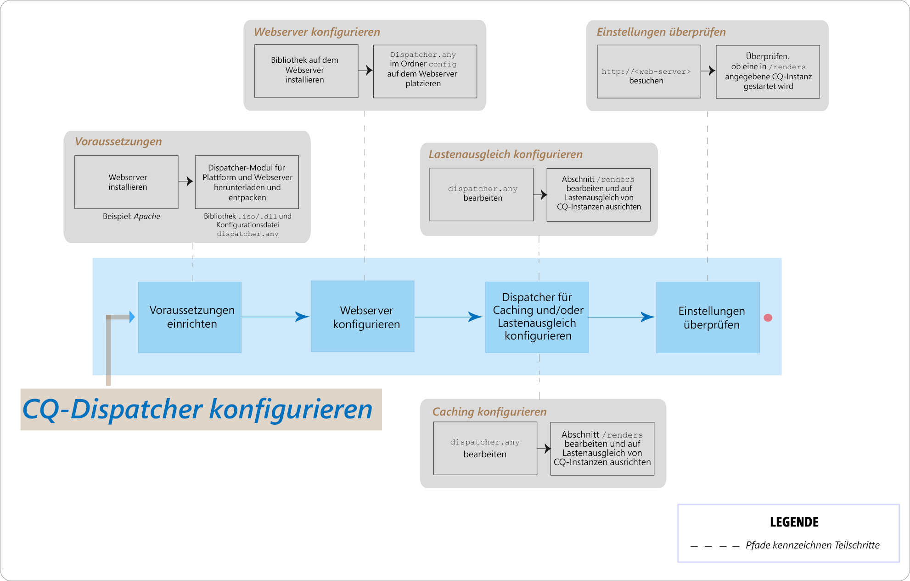

# Häufig gestellte Fragen zu Problemen bei AEM Dispatcher



## Einführung

### Was genau ist der Dispatcher?

Der Dispatcher ist das Caching- bzw. Lastenausgleichstool von Adobe Experience Manager, das für eine schnelle und dynamische Web-Authoring-Umgebung sorgt. Der Dispatcher übernimmt Caching-Aufgaben als Teil eines HTTP-Servers wie etwa Apache mit dem Ziel, so viel statische Website-Inhalte wie möglich zu speichern (oder zu „cachen“) und so selten wie möglich auf die Layout-Engine der Website zuzugreifen. Beim Lastenausgleich verteilt der Dispatcher Benutzeranforderungen (Lasten) auf verschiedene AEM-Instanzen (Renderings).

Zum Caching nutzt das Dispatcher-Modul die Fähigkeit des Webservers, statische Inhalte bereitzustellen. Der Dispatcher legt die zwischengespeicherten Dokumente im Basisverzeichnis des Webservers ab.

### Wie führt der Dispatcher das Caching durch?

Das Dispatcher-Modul nutzt die Fähigkeit des Webservers, statische Inhalte bereitzustellen. Der Dispatcher legt die zwischengespeicherten Dokumente im Basisverzeichnis des Webservers ab. Der Dispatcher verwendet zwei Hauptverfahren zum Aktualisieren des zwischengespeicherten Inhalts, wenn Änderungen an der Website vorgenommen werden.

* **Inhaltsaktualisierungen** entfernen die geänderten Seiten sowie die Dateien, die sich direkt auf sie beziehen.
* **Automatische Invalidierung** macht automatisch jene Teile des Caches ungültig, die nach einer Aktualisierung möglicherweise veraltet sind. Dies bedeutet beispielsweise, dass entsprechende Seiten als veraltet markiert werden, ohne dass diese gelöscht werden.

### Welche Vorteile hat der Lastenausgleich?

Der Lastenausgleich verteilt Benutzeranforderungen (Lasten) auf mehrere AEM-Instanzen. In der folgenden Liste werden die Vorteile des Lastenausgleichs beschrieben:

* **Verbesserte Verarbeitungsleistung**: In der Praxis bedeutet dies, dass der Dispatcher Dokumentenanfragen zwischen mehreren Instanzen von AEM aufteilt. Da jede Instanz weniger Dokumente zu verarbeiten hat, sind die Reaktionszeiten kürzer. Der Dispatcher führt interne Statistiken für jede Dokumentenkategorie, sodass die Anforderungen geschätzt und die Abfragen effizient aufgeteilt werden können.
* **Verbesserte Fail-Safe-Abdeckung**: Wenn der Dispatcher keine Antwort von einer Instanz empfängt, werden Anforderungen automatisch an eine der anderen Instanzen weitergeleitet. Wenn eine Instanz nicht verfügbar ist, ist die einzige Auswirkung daher eine Verlangsamung der Site, proportional zur verloren gegangenen Rechenleistung.

>[!NOTE]
>
>Weitere Informationen finden Sie auf der Seite [Dispatcher-Übersicht](dispatcher.md).

## Installieren und Konfigurieren

### Wo kann ich das Dispatcher-Modul herunterladen?

Sie können das neueste Dispatcher-Modul über die Seite [Versionshinweise zu Dispatcher](release-notes.md) herunterladen.

### Wie installiere ich das Dispatcher-Modul?

Dies erfahren Sie unter [Installieren des Dispatchers](dispatcher-install.md).

### Wie konfiguriere ich das Dispatcher-Modul?

Dies erfahren Sie unter [Konfigurieren des Dispatchers](dispatcher-configuration.md).

### Wie konfiguriere ich den Dispatcher für die Autoreninstanz?

Ausführliche Anweisungen finden Sie unter [Verwenden des Dispatchers mit einer Autoreninstanz](dispatcher.md#using-a-dispatcher-with-an-author-server).

### Wie konfiguriere ich den Dispatcher mit mehreren Domänen?

Sie können den CQ Dispatcher mit mehreren Domänen konfigurieren, sofern die Domänen die folgenden Bedingungen erfüllen:

* Der Webinhalt für beide Domänen wird in einem einzelnen AEM-Repository gespeichert.
* Die Dateien im Dispatcher-Cache können getrennt für jede Domäne ungültig gemacht werden

Weitere Informationen erhalten Sie unter [Verwenden des Dispatchers mit mehreren Domänen](dispatcher-domains.md).

### Wie konfiguriere ich den Dispatcher so, dass alle Anforderungen eines Benutzers an dieselbe Veröffentlichungsinstanz weitergeleitet werden?

Sie können die Funktion für [Sticky-Verbindungen](dispatcher-configuration.md#identifying-a-sticky-connection-folder-stickyconnectionsfor) verwenden, um sicherzustellen, dass alle Dokumente für einen Benutzer in derselben Instanz von AEM verarbeitet werden. Diese Funktion ist wichtig, wenn Sie personalisierte Seiten und Sitzungsdaten verwenden. Die Daten werden in der Instanz gespeichert. Nachfolgende Anfragen desselben Benutzers müssen daher zu dieser Instanz zurückgegeben werden oder die Daten gehen verloren.

Da durch Sticky-Verbindungen die Fähigkeit des Dispatchers eingeschränkt wird, die Anfragen zu optimieren, sollten Sie diesen Ansatz nur wenn nötig verwenden. Sie können den Ordner mit Sticky-Dokumenten angeben und so sicherstellen, dass alle Dokumente in diesem Ordner für jeden Benutzer auf derselben Instanz verarbeitet werden.

### Kann ich Sticky-Verbindungen und Caching gleichzeitig verwenden?

Bei den meisten Seiten, die Sticky-Verbindungen verwenden, sollten Sie die Zwischenspeicherung deaktivieren. Andernfalls wird allen Benutzern unabhängig vom Sitzungsinhalt dieselbe Instanz der Seite angezeigt.

Für einige Anwendungen können sowohl Sticky-Verbindungen als auch Caching verwendet werden. Wenn Sie beispielsweise ein Formular anzeigen, das Daten in eine Sitzung schreibt, können Sie Sticky-Verbindungen und Caching gleichzeitig verwenden.

### Können sich Dispatcher und eine AEM-Veröffentlichungsinstanz auf demselben physischen Computer befinden?

Ja, wenn der Computer ausreichend leistungsfähig ist. Es wird jedoch empfohlen, den Dispatcher und die AEM-Veröffentlichungsinstanz auf verschiedenen Computern einzurichten.

Normalerweise befindet sich die Veröffentlichungsinstanz in der Firewall und der Dispatcher in der DMZ. Wenn Sie sich dafür entscheiden, dass sich die Veröffentlichungsinstanz und der Dispatcher auf demselben physischen Computer befinden, ist sicherzustellen, dass die Firewall-Einstellungen den direkten Zugriff von externen Netzwerken auf die Veröffentlichungsinstanz verhindern.

### Kann ich nur Dateien mit bestimmten Erweiterungen zwischenspeichern?

Ja. Wenn Sie beispielsweise nur GIF-Dateien zwischenspeichern möchten, geben Sie *.gif im Cache-Abschnitt der Konfigurationsdatei „dispatcher.any“ an.

### Wie lösche ich Dateien aus dem Cache?

Sie können Dateien mittels HTTP-Anfrage aus dem Cache löschen. Nach Empfang der HTTP-Anfrage löscht der Dispatcher die Dateien aus dem Cache. Der Dispatcher speichert die Dateien nur dann erneut im Cache, wenn eine Clientanfrage für die Seite eingeht. Auf diese Weise zwischengespeicherte Dateien zu löschen, empfiehlt sich für Websites mit geringer Wahrscheinlichkeit, gleichzeitige Anfragen für ein und dieselbe Seite zu empfangen.

Die HTTP-Anfrage hat folgende Syntax:

```
POST /dispatcher/invalidate.cache HTTP/1.1
CQ-Action: Activate
CQ-Handle: path-pattern
Content-Length: 0
```

Der Dispatcher leert (löscht) die zwischengespeicherten Dateien und Ordner mit Namen, die dem Wert des Headers des CQ-Handles entsprechen. Beispielsweise entspricht der CQ-Handle mit dem Wert `/content/geomtrixx-outdoors/en`:

Allen Dateien (mit einer beliebigen Dateierweiterung) mit dem Namen „en“ im Verzeichnis geometrixx-outdoors. Allen Verzeichnissen mit dem Namen `_jcr_content` unter dem Verzeichnis „en“ (das, falls vorhanden, zwischengespeicherte Renderings von Unterknoten der Seite enthält). Das Verzeichnis „en“ wird nur gelöscht, wenn `CQ-Action` `Delete` oder `Deactivate` entspricht.

Weitere Einzelheiten zu diesem Thema finden Sie unter [Manuelle Invalidierung des Dispatcher-Caches](page-invalidate.md).

### Wie implementiere ich berechtigungssensitive Zwischenspeicherung?

Lesen Sie hierzu [Zwischenspeichern sicherer Inhalte](permissions-cache.md).

### Wie sichere ich die Kommunikation zwischen den Dispatcher- und CQ-Instanzen?

Siehe die Seiten [Dispatcher-Sicherheits-Checkliste](security-checklist.md) und [AEM Sicherheitscheckliste](https://helpx.adobe.com/experience-manager/6-4/sites/administring/using/security-checklist.html) .

### Dispatcher-Problem `jcr:content` geändert in `jcr%3acontent`

**Frage**: In letzter Zeit trat ein Problem auf Dispatcher-Ebene auf, bei dem einer der Ajax-Aufrufe, die Daten aus dem CQ-Repository abrufen, `jcr:content` enthielt. Dies wurde codiert als `jcr%3acontent`, was zu einem falschen Ergebnis führte.

**Antwort**: Verwenden Sie die Methode `ResourceResolver.map()`, um eine URL abzurufen, von der Anfragen entsprechend abgerufen bzw. ausgegeben werden, und um das Caching-Problem mit dem Dispatcher zu lösen. Die Methode „map()“ codiert den Doppelpunkt `:` zu Unterstrichen, die Methode „resolve()“ decodiert sie zurück in das von SLING JCR lesbare Format. Generieren Sie die im Ajax-Aufruf verwendete URL mittels „map()“.

Weitere Informationen: [https://sling.apache.org/documentation/the-sling-engine/mappings-for-resource-resolution.html#namespace-mangling](https://sling.apache.org/documentation/the-sling-engine/mappings-for-resource-resolution.html#namespace-mangling)

## Dispatcher bereinigen

### Wie konfiguriere ich Dispatcher-Flush-Agenten auf einer Veröffentlichungsinstanz?

Siehe die Seite [Replikation](https://helpx.adobe.com/content/help/en/experience-manager/6-4/sites/deploying/using/replication.html#ConfiguringyourReplicationAgents) .

### Wie kann ich Dispatcher-Bereinigungsprobleme beheben?

[In diesem Artikel zur Fehlerbehebung finden Sie ](https://helpx.adobe.com/content/help/en/experience-manager/kb/troubleshooting-dispatcher-flushing-issues.html) Antworten auf die folgenden Fragen:

* Wie kann ich eine Situation lösen, in der kein Inhalt im Dispatcher-Cache gespeichert wird?
* Wie kann ich ein Problem beheben, bei dem Cachedateien nicht aktualisiert werden?
* Wie kann ich eine Situation lösen, in der das Dispatcher-Flushing überhaupt nicht funktioniert?

Wenn der Dispatcher durch Löschvorgänge geleert wird, können Sie das Problem [wie in diesem Community-Blog-Beitrag von Sensei Martin beschrieben](https://mkalugin-cq.blogspot.in/2012/04/i-have-been-working-on-following.html) umgehen.

### Wie lösche ich DAM-Assets aus dem Dispatcher-Cache?

Mithilfe der Funktion „chain replication“.  Ist diese Funktion aktiviert, sendet der Dispatcher-Flush-Agent eine Flush-Anforderung bei Empfang einer Replikation vom Autor.

So aktivieren Sie ihn:

1. Folgen Sie [diesen Schritten](page-invalidate.md#invalidating-dispatcher-cache-from-a-publishing-instance) zur Erstellung von Flushing-Agenten beim Veröffentlichen.
1. Wechseln Sie zu den Konfigurationen des Agenten und markieren Sie auf der Registerkarte **Auslöser** das Feld **Bei Empfang**.

## Sonstiges

Wie erkennt der Dispatcher, ob ein Dokument aktuell ist?
Um zu bestimmen, ob ein Dokument aktuell ist, führt der Dispatcher diese Aktionen durch:

Es wird geprüft, ob für das Dokument die automatische Invalidierung ausgeführt wird. Ist dies nicht der Fall, wird das Dokument als aktuell betrachtet.
Wenn das Dokument für die automatische Invalidierung konfiguriert wurde, überprüft der Dispatcher, ob es älter oder neuer als die letzte verfügbare Änderung ist. Wenn es älter ist, ruft der Dispatcher die aktuelle Version von der AEM-Instanz ab und ersetzt die Version im Cache.

### Wie werden die Dispatcher-Rückgabedokumente zurückgegeben?

Sie können über die [Dispatcher-Konfigurationsdatei](dispatcher-configuration.md) `dispatcher.any` festlegen, ob der Dispatcher ein Dokument zwischenspeichert. Der Dispatcher überprüft die Anforderung anhand der Liste der Dokumente, die zwischengespeichert werden können. Wenn das Dokument nicht in dieser Liste enthalten ist, fragt der Dispatcher das Dokument in der AEM-Instanz ab.

Die `/rules`-Eigenschaft steuert anhand des Dokumentenpfads, welche Dokumente zwischengespeichert werden sollen. Unabhängig von der `/rules`-Eigenschaft werden in folgenden Fällen Dokumente nie zwischengespeichert:

* Der Anfrage-URI enthält ein Fragezeichen `(?)`.
* Hierdurch wird normalerweise eine dynamische Seite angegeben (z. B. ein Suchergebnis), die nicht zwischengespeichert werden muss.
* Die Dateierweiterung fehlt.
* Der Webserver benötigt die Erweiterung, um den Dokumenttyp (den MIME-Typ) zu bestimmen.
* Der Authentifizierungsheader wurde festgelegt (dies kann konfiguriert werden).
* Die AEM-Instanz antwortet mit folgenden Headern:
   * no-cache
   * no-store
   * must-revalidate

Der Dispatcher speichert die zwischengespeicherten Dateien auf dem Webserver, als wären sie Teil einer statischen Website. Wenn ein Benutzer ein zwischengespeichertes Dokument anfordert, überprüft der Dispatcher, ob das Dokument im Dateisystem des Webservers vorhanden ist: Ist dies der Fall, gibt der Dispatcher die Dokumente zurück. Wenn nicht, fordert der Dispatcher das Dokument von der AEM-Instanz an.

>[!NOTE]
>
>Die Methoden GET oder HEAD (für den HTTP-Header) können vom Dispatcher zwischengespeichert werden. Weitere Informationen zum Zwischenspeichern von Antwortheadern finden Sie im Abschnitt [Zwischenspeichern von HTTP-Antwortheadern](dispatcher-configuration.md#caching-http-response-headers).

### Kann ich mehrere Dispatcher in einem Setup implementieren?

Ja. In solchen Fällen müssen beide Dispatcher direkt auf die AEM-Website zugreifen. Ein Dispatcher kann keine Anforderungen aus einem anderen Dispatcher verarbeiten.
