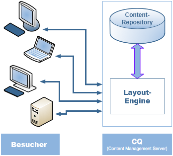
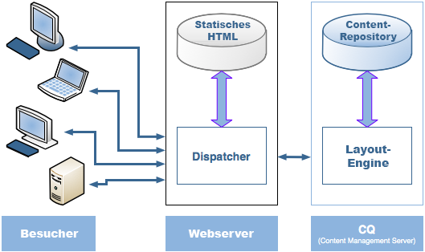
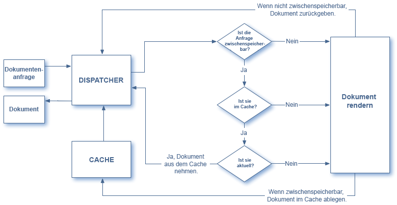
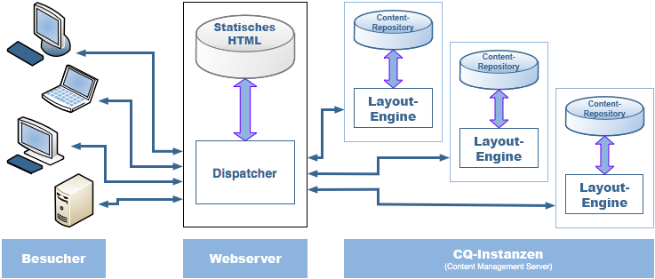

# Dispatcher-Übersicht {#dispatcher-overview}

>[!NOTE]
>
>Dispatcher-Versionen sind unabhängig von AEM. Möglicherweise wurden Sie von der Dokumentation zu einer früheren AEM-Version zu dieser Seite weitergeleitet.

Der Dispatcher ist ein Tool von Adobe Experience Manager für das Zwischenspeichern und/oder den Lastenausgleich. Mit dem Dispatcher von AEM können Sie außerdem Ihren AEM-Server vor Angriffen schützen. Daher können Sie die Sicherheit Ihrer AEM-Instanz verbessern, indem Sie den Dispatcher in Verbindung mit einem Webserver der Unternehmensklasse verwenden.

Die Bereitstellung des Dispatchers ist unabhängig von Webserver und Betriebssystem:

1. Weitere Informationen zum Dispatcher (diese Seite). Siehe auch: [häufig gestellte Fragen zum Dispatcher](https://helpx.adobe.com/de/experience-manager/using/dispatcher-faq.html).
1. Installieren Sie einen [unterstützten Webserver](https://helpx.adobe.com/de/experience-manager/6-3/sites/deploying/using/technical-requirements.html) gemäß der Webserver-Dokumentation.

1. [Installieren Sie das Dispatcher-Modul](dispatcher-install.md) auf Ihrem Webserver und konfigurieren Sie den Webserver dementsprechend.
1. [Konfigurieren Sie den Dispatcher](dispatcher-configuration.md) (Datei „dispatcher.any“).

1. [Konfigurieren Sie AEM](page-invalidate.md), sodass der Cache durch Inhaltsaktualisierungen invalidiert wird.

>[!NOTE]
>
>Weitere Informationen zur Funktionsweise des Dispatchers mit AEM finden Sie unter [Fragen Sie die AEM Community-Experten Juli 2017](https://bit.ly/ATACE0717).

Ziehen Sie bei Bedarf die folgenden Ressourcen hinzu:

* [Die Dispatcher-Sicherheitscheckliste](security-checklist.md)
* [Die Dispatcher-Wissensdatenbank](https://helpx.adobe.com/cq/kb/index/dispatcher.html)
* [Optimierung von Websites für die Cache-Leistung]( https://helpx.adobe.com/de/experience-manager/6-4/sites/deploying/using/configuring-performance.html)
* [Verwenden des Dispatchers mit mehreren Domänen](dispatcher-domains.md)
* [Verwenden von SSL mit dem Dispatcher](dispatcher-ssl.md)
* [Implementieren der Zwischenspeicherung unter Berücksichtigung von Berechtigungen](permissions-cache.md)
* [Beheben von Problemen beim Dispatcher](dispatcher-troubleshooting.md)
* [Häufig gestellte Fragen zu Problemen beim Dispatcher](dispatcher-faq.md)

>[!NOTE]
>
>**Die häufigste Verwendung des Dispatchers** ist das Zwischenspeichern von Antworten aus einer AEM-**Veröffentlichungsinstanz**, um die Reaktionsfähigkeit und Sicherheit einer öffentlich zugänglichen veröffentlichten Website zu erhöhen. Diese Anwendung steht im Mittelpunkt des Themas.
>
>Mit dem Dispatcher kann jedoch auch die Reaktionsgeschwindigkeit der **Autoreninstanz** gesteigert werden, besonders wenn viele Benutzer Ihre Website bearbeiten und aktualisieren. Weitere Informationen zu diesem speziellen Fall finden Sie unten unter [Verwenden eines Dispatchers mit einem Autorenserver](#using-a-dispatcher-with-an-author-server).

## Gründe für die Verwendung des Dispatchers zum Implementieren der Zwischenspeicherung  {#why-use-dispatcher-to-implement-caching}

Es gibt zwei grundlegende Ansätze zum Veröffentlichen im Web:

* **Statische Webserver**, z. B. Apache oder IIS, sind sehr einfach und schnell.
* **Inhaltsverwaltungsserver** stellen dynamische, intelligente Inhalte in Echtzeit bereit, benötigen jedoch erheblich längere Berechnungszeiten und andere Ressourcen.

Mit dem Dispatcher können Sie eine Umgebung realisieren, die gleichzeitig schnell und dynamisch ist. Der Dispatcher funktioniert als Teil eines statischen HTML-Servers wie Apache mit folgendem Ziel:

* Speichern (oder „Caching“) von möglichst vielen Site-Inhalten in Form einer statischen Website
* Möglichst wenig Zugriff auf die Layout-Engine

Dies bedeutet:

* **Statische Inhalte** werden mit genau derselben Geschwindigkeit und Flexibilität wie auf einem statischen Webserver bearbeitet. *Außerdem können Sie die für Ihren statischen Webserver verfügbaren Administrations- und Sicherheitstools verwenden*.

* **Dynamische Inhalte** werden nach Bedarf generiert, ohne das System mehr als absolut notwendig zu verlangsamen.

Der Dispatcher umfasst Mechanismen zum Generieren und Aktualisieren von statischem HTML auf Grundlage der Inhalte der dynamischen Website. Sie können detailliert angeben, welche Dokumente als statische Dateien gespeichert werden sollen und welche immer dynamisch generiert werden.

In diesem Abschnitt werden die hierbei zugrunde liegenden Prinzipien beschrieben.

### Statischer Webserver  {#static-web-server}


Ein statischer Webserver, wie z. B. Apache oder IIS, stellt statische HTML-Dateien für die Besucher Ihrer Website bereit. Statische Seiten werden einmalig erstellt, daher wird derselbe Inhalt für jede Anforderung bereitgestellt.

Dieser Vorgang ist sehr einfach und daher sehr effizient. Wenn ein Benutzer eine Datei anfordert (z. B. eine HTML-Seite), wird die Datei zumeist auch direkt aus dem Speicher abgerufen und höchstens von der lokalen Festplatte gelesen. Statische Webserver sind bereits seit einiger Zeit verfügbar, sodass eine umfangreiche Auswahl an Werkzeugen für Administration und Sicherheitsverwaltung bereitsteht. Außerdem sind sie sehr gut in Netzwerkinfrastrukturen integriert.

### Inhaltsverwaltungsserver  {#content-management-servers}



Wenn Sie einen Inhaltsverwaltungsserver wie AEM verwenden, wird die Anforderung eines Besuchers durch eine erweiterte Layout-Engine verarbeitet. Die Engine liest Inhalte aus einem Repository, das diese kombiniert mit Stilen, Formaten und Zugriffsrechten in ein Dokument umwandelt, das individuell auf die Anforderungen des Besuchers abgestimmt ist.

So können Sie vielseitigere, dynamische Inhalte erstellen und die Flexibilität und den Funktionsumfang Ihrer Website steigern. Allerdings ist für die Layout-Engine mehr Verarbeitungsleistung als für einen statischen Server erforderlich. Daher ist dieses Setup für Verzögerungen anfällig, wenn viele Besucher das System verwenden.

## Zwischenspeicherung durch den Dispatcher  {#how-dispatcher-performs-caching}



**Das Cache-Verzeichnis** Zum Zwischenspeichern nutzt das Dispatcher-Modul die Fähigkeit des Webservers, statische Inhalte bereitzustellen. Der Dispatcher legt die zwischengespeicherten Dokumente im Basisverzeichnis des Webservers ab.

>[!NOTE]
>
>Wenn die Konfiguration für das Zwischenspeichern von HTTP-Headern fehlt, speichert der Dispatcher nur den HTML-Code der Seite. Die HTTP-Header werden nicht gespeichert. Dies kann problematisch sein, wenn Sie verschiedene Kodierungen in Ihrer Website verwenden, da diese unter Umständen verloren gehen. Informationen zum Aktivieren der HTTP-Header-Zwischenspeicherung finden Sie unter [Konfigurieren des Dispatcher-Cache.](https://helpx.adobe.com/de/experience-manager/dispatcher/using/dispatcher-configuration.html)

>[!NOTE]
>
>Das Suchen des Dokumentenstamms Ihres Webservers auf NAS-Speichern führt zu einer verringerten Leistung. Auch wenn ein Basisverzeichnis auf NAS von mehreren Webservern gemeinsam genutzt wird, können zwischenzeitlich Sperren auftreten, wenn Replikationsaktionen durchgeführt werden.

>[!NOTE]
>
>Der Dispatcher speichert das zwischengespeicherte Dokument in einer Struktur, die der angeforderten URL entspricht.
>
>Auf Betriebssystemebene können Einschränkungen für die Länge des Dateinamens gelten, z. B. bei einer URL mit vielen Selektoren.

### Methoden für die Zwischenspeicherung 

Der Dispatcher verwendet zwei Hauptverfahren zum Aktualisieren des zwischengespeicherten Inhalts, wenn Änderungen an der Website vorgenommen werden.

* **Inhaltsaktualisierungen** entfernen die geänderten Seiten sowie die Dateien, die sich direkt auf sie beziehen.
* **Die automatische Invalidierung** macht automatisch jene Teile des Caches ungültig, die nach einer Aktualisierung möglicherweise veraltet sind. Dies bedeutet, dass entsprechende Seiten als veraltet markiert werden, ohne dass Daten gelöscht werden.

### Inhaltsaktualisierungen

Bei einer Inhaltsaktualisierung werden ein oder mehrere AEM-Dokumente geändert. AEM sendet eine Syndizierungsanforderung an den Dispatcher, der den Cache entsprechend aktualisiert:

1. Die bearbeiteten Dateien werden aus dem Cache gelöscht.
1. Es werden alle Dateien aus dem Cache gelöscht, die mit demselben Handle beginnen. Wenn beispielsweise die Datei „/de/index.html“ aktualisiert wird, werden alle Dateien, die mit „/de/index.“ beginnen, gelöscht. Auf diese Weise können Sie Cache-effiziente Sites erstellen, insbesondere im Hinblick auf die Navigation bei Bildern.
1. Die sogenannte **Statfile** wird *bearbeitet*, indem der Zeitstempel der Statfile aktualisiert wird, um das Datum der letzten Änderung anzugeben.

Beachten Sie die folgenden Punkte:

* Inhaltsaktualisierungen werden in der Regel in Verbindung mit einem Authoring-System verwendet, das „weiß“, was ersetzt werden muss.
* Dateien, die von einer Aktualisierung betroffen sind, werden entfernt, aber nicht sofort ersetzt. Das nächste Mal, wenn eine solche Datei angefordert wird, ruft der Dispatcher die neue Datei aus der AEM-Instanz ab und speichert sie im Cache, sodass der alte Inhalt überschrieben wird.
* In der Regel werden automatisch generierte Bilder, die Text von einer Seite enthalten, in den Bilddateien gespeichert, die mit demselben Handle beginnen. So wird gewährleistet, dass die Zuordnung zum Löschen vorhanden ist. Sie können z. B. den Titeltext der Seite „mypage.html“ als Bilddatei „mypage.titlePicture.gif“ im selben Verzeichnis speichern. Auf diese Weise wird das Bild automatisch jedes Mal aus dem Cache gelöscht, wenn die Seite aktualisiert wird. So können Sie sicher sein, dass das Bild immer die aktuelle Version der Seite darstellt.
* Sie können mehrere Statfiles verwenden, z. B. eine pro Ordner. Wenn eine Seite aktualisiert wird, sucht AEM den nächsten übergeordneten Ordner, der eine Statfile enthält, und *ändert*  diese Datei.

### Automatische Invalidierung

Bei der automatischen Invalidierung werden Teile des Caches automatisch ungültig gemacht – ohne Dateien physisch zu löschen. Bei jeder Inhaltsaktualisierung wird die sogenannte Statfile bearbeitet, sodass der Zeitstempel den Zeitpunkt der letzten Aktualisierung angibt.

Der Dispatcher verfügt über eine Liste der Dateien, für die die automatische Invalidierung gilt. Wenn ein Dokument aus dieser Liste angefordert wird, vergleicht der Dispatcher das Datum des zwischengespeicherten Dokuments mit dem Zeitstempel der Statfile:

* Wenn das zwischengespeicherte Dokument neuer ist, gibt der Dispatcher es zurück.
* Wenn es älter ist, ruft der Dispatcher die aktuelle Version aus der AEM-Instanz ab.

Auch hier sollten bestimmte Punkte beachtet werden:

* Die automatische Invalidierung wird normalerweise bei komplexen Wechselbeziehungen verwendet, z. B. für HTML-Seiten. Diese Seiten enthalten Links und Navigationseinträge, sodass sie in der Regel nach einer Inhaltsaktualisierung aktualisiert werden müssen. Wenn Sie automatisch generierte PDF- oder Bilddateien haben, können Sie auch für diese die automatische Invalidierung festlegen.
* Für die automatische Invalidierung ist bei der Aktualisierung keine Aktion durch den Dispatcher erforderlich, mit Ausnahme der Bearbeitung der Statfile. Durch das Bearbeiten der Statfile ist allerdings automatisch der Inhalt des Zwischenspeichers veraltet, ohne dass er physisch aus dem Cache entfernt wird.

## Zurückgeben von Dokumenten durch den Dispatcher  {#how-dispatcher-returns-documents}



### Festlegen, ob ein Dokument zwischengespeichert werden soll

Sie können [definieren, welche Dokumente der Dispatcher in der Konfigurationsdatei zwischenspeichert](https://helpx.adobe.com/de/experience-manager/dispatcher/using/dispatcher-configuration.html). Der Dispatcher überprüft die Anforderung anhand der Liste der Dokumente, die zwischengespeichert werden können. Wenn das Dokument nicht in dieser Liste enthalten ist, fragt der Dispatcher das Dokument in der AEM-Instanz ab.

Der Dispatcher ruft das Dokument in den folgenden Fällen *immer* direkt aus der AEM-Instanz ab:

* Der Anfrage-URI enthält ein Fragezeichen „?“. Hierdurch wird normalerweise eine dynamische Seite angegeben (z. B. ein Suchergebnis), die nicht zwischengespeichert werden muss.
* Die Dateierweiterung fehlt. Der Webserver benötigt die Erweiterung, um den Dokumenttyp (den MIME-Typ) zu bestimmen.
* Der Authentifizierungsheader wurde festgelegt (dies kann konfiguriert werden).

>[!NOTE]
>
>Die Methoden GET oder HEAD (für den HTTP-Header) können vom Dispatcher zwischengespeichert werden. Weitere Informationen zur Zwischenspeicherung von Antwortheadern finden Sie im Abschnitt [Zwischenspeichern von HTTP-Antwortheadern](https://helpx.adobe.com/de/experience-manager/dispatcher/using/dispatcher-configuration.html).

### Bestimmen, ob ein Dokument zwischengespeichert wird 

Der Dispatcher speichert die zwischengespeicherten Dateien auf dem Webserver, als wären sie Teil einer statischen Website. Wenn ein Benutzer ein Cache-fähiges Dokument anfordert, überprüft der Dispatcher, ob das Dokument im Dateisystem des Webservers vorhanden ist:

* Wenn das Dokument zwischengespeichert wurde, gibt der Dispatcher die Datei zurück.
* Wenn es nicht zwischengespeichert wurde, fordert der Dispatcher das Dokument von der AEM-Instanz an.

### Bestimmen, ob ein Dokument aktuell ist

Um festzustellen, ob ein Dokument aktuell ist, führt der Dispatcher zwei Schritte aus:

1. Es wird geprüft, ob für das Dokument die automatische Invalidierung ausgeführt wird. Ist dies nicht der Fall, wird das Dokument als aktuell betrachtet.
1. Wenn das Dokument für die automatische Invalidierung konfiguriert wurde, überprüft der Dispatcher, ob es älter oder neuer als die letzte verfügbare Änderung ist. Wenn es älter ist, ruft der Dispatcher die aktuelle Version von der AEM-Instanz ab und ersetzt die Version im Cache.

>[!NOTE]
>
>Dokumente ohne **automatische Invalidierung** verbleiben im Cache, bis sie physisch gelöscht werden, z. B. durch eine Inhaltsaktualisierung auf der Website. 

## Vorteile des Lastenausgleichs {#the-benefits-of-load-balancing}

Beim Lastenausgleich wird die Rechenleistung für eine Website auf mehrere Instanzen von AEM verteilt.



Vorteile:

* **Verbesserte Verarbeitungsleistung** In der Praxis bedeutet dies, dass der Dispatcher Dokumentanforderungen zwischen mehreren Instanzen von AEM aufteilt. Da jede Instanz jetzt weniger Dokumente verarbeiten muss, sind die Reaktionszeiten kürzer. Der Dispatcher führt interne Statistiken für jede Dokumentenkategorie, sodass die Anforderungen geschätzt und die Abfragen effizient aufgeteilt werden können.

* **Verbesserte Fail-Safe-Abdeckung** Wenn der Dispatcher keine Antwort von einer Instanz empfängt, werden Anforderungen automatisch an eine der anderen Instanzen weitergeleitet. Wenn eine Instanz nicht verfügbar ist, ist die einzige Auswirkung daher eine Verlangsamung der Site, proportional zur verloren gegangenen Rechenleistung. Alle Dienste werden fortgesetzt.

* Sie können außerdem verschiedene Websites auf demselben statischen Webserver verwalten.

>[!NOTE]
>
>Während die Auslastung durch den Lastenausgleich effizient verteilt wird, wird sie durch die Zwischenspeicherung reduziert. Daher sollten Sie das Zwischenspeichern optimieren und die Gesamtauslastung reduzieren, bevor Sie den Lastenausgleich einrichten. Durch eine optimal konfigurierte Zwischenspeicherung kann die Leistung des Lastenausgleichs gesteigert oder der Lastausgleich überflüssig gemacht werden.

>[!CAUTION]
>
>Während ein einzelner Dispatcher normalerweise in der Lage ist, die Kapazität der verfügbaren Veröffentlichungsinstanzen auszunutzen, kann es bei einigen wenigen Anwendungen sinnvoll sein, zusätzlich einen Lastenausgleich zwischen zwei Dispatcher-Instanzen einzurichten. Konfigurationen mit mehreren Dispatchern müssen sorgfältig durchdacht werden, da ein weiterer Dispatcher die Auslastung der verfügbaren Veröffentlichungsinstanzen erhöht und schnell zu einer Leistungsverringerung bei den meisten Anwendungen führen kann.

## Durchführen des Lastenausgleichs durch den Dispatcher  {#how-the-dispatcher-performs-load-balancing}

### Leistungsstatistiken

Der Dispatcher führt interne Statistiken dazu, wie schnell die einzelnen AEM-Instanzen Dokumente verarbeiten. Auf Grundlage dieser Daten schätzt der Dispatcher, welche Instanz die schnellste Reaktionszeit beim Beantworten einer Anforderung bereitstellt, und reserviert die erforderliche Berechnungszeit auf dieser Instanz.

Für andere Arten von Anforderungen können andere durchschnittliche Bearbeitungszeiten gelten, daher können Sie mit dem Dispatcher Dokumentenkategorien angeben. Diese werden dann beim Berechnen der Zeitschätzungen berücksichtigt. Beispielsweise können Sie zwischen HTML-Seiten und Bildern differenzieren, da die typischen Antwortzeiten sich hier wahrscheinlich deutlich unterscheiden.

Wenn Sie eine umfangreiche Suchfunktion verwenden, sollten Sie eine neue Kategorie für Suchabfragen erstellen. So kann der Dispatcher Suchabfragen an die Instanz senden, die am schnellsten reagiert. Auf diese Weise wird verhindert, dass eine langsamere Instanz nicht mehr reagiert, wenn sie mehrere „schwere“ Suchanfragen erhält, während die anderen „leichtere“ Anforderungen erhalten.

### Personalisierte Inhalte („Sticky-Verbindungen“) 

Sticky-Verbindungen stellen sicher, dass alle Dokumente für einen Benutzer auf derselben AEM-Instanz erstellt werden. Dies ist wichtig, wenn Sie personalisierte Seiten und Sitzungsdaten verwenden. Die Daten werden in der Instanz gespeichert, sodass nachfolgende Anforderungen vom selben Benutzer zu dieser Instanz zurückführen müssen. Andernfalls gehen die Daten verloren.

Da durch Sticky-Verbindungen die Fähigkeit des Dispatchers eingeschränkt wird, die Anforderungen zu optimieren, sollten Sie sie nur bei Bedarf verwenden. Sie können den Ordner angeben, in dem die „Sticky-Dokumente“ gespeichert werden, und so sicherstellen, dass alle Dokumente in diesem Ordner für jeden Benutzer auf derselben Instanz erstellt werden.

>[!NOTE]
>
>Bei den meisten Seiten, die Sticky-Verbindungen verwenden, müssen Sie das Zwischenspeichern deaktivieren. Andernfalls wird die Seite für alle Benutzer gleich angezeigt, unabhängig vom Sitzungsinhalt.
>
>Bei *einigen* Anwendungen ist es möglich, Sticky-Verbindungen und Zwischenspeichern zu verwenden, zum Beispiel, wenn Sie ein Formular anzeigen, das Daten in die Sitzung schreibt.

## Verwenden mehrerer Dispatcher {#using-multiple-dispatchers}

In komplexen Umgebungen können Sie mehrere Dispatcher verwenden. Folgende Szenarien sind möglich:

* Ein Dispatcher zum Veröffentlichen einer Website im Intranet
* Ein zweiter Dispatcher mit einer anderen Adresse und anderen Sicherheitseinstellungen zum Veröffentlichen desselben Inhalts im Internet

In einem solchen Fall müssen Sie sicherstellen, dass jede Anforderung nur einen Dispatcher durchläuft. Ein Dispatcher verarbeitet keine Anforderungen, die von einem anderen Dispatcher stammen. Stellen Sie daher sicher, dass beide Dispatcher direkt auf die AEM-Website zugreifen.

## Verwenden des Dispatchers mit einem CDN  {#using-dispatcher-with-a-cdn}

Ein CDN (Content Delivery Network) wie Akamai Edge Delivery oder Amazon Cloud Front stellt Inhalte von einem Speicherort in der Nähe des Endbenutzers bereit. Dies hat folgende Vorteile:

* Verkürzung der Reaktionszeiten für Endbenutzer
* Verringern der Auslastung Ihrer Server

Als HTTP-Infrastrukturkomponente funktioniert ein CDN ähnlich wie der Dispatcher: Wenn ein CDN-Knoten eine Anforderung erhält, wird die Anforderung aus dem Cache beantwortet, sofern möglich (d. h. die Ressource ist im Cache verfügbar und gültig). Andernfalls wird der nächstgelegene Server kontaktiert, um die Ressource abzurufen und sie ggf. für weitere Anforderungen zwischenzuspeichern.

Welcher Server der nächstgelegene ist, hängt von Ihrem jeweiligen Setup ab. In einem Akamai-Setup kann die Abfrage z. B. den folgenden Pfad durchlaufen:

* Akamai Edge-Knoten
* Akamai-Midgress-Ebene
* Ihre Firewall
* Ihr Lastenausgleich
* Dispatcher
* AEM

In den meisten Fällen ist der Dispatcher der nächstgelegene Server, der das Dokument aus einem Cache bereitstellen und die Antwort-Header beeinflussen kann, die an den CDN-Server zurückgegeben werden.

## Steuern eines CDN-Caches  {#controlling-a-cdn-cache}

Es gibt verschiedene Möglichkeiten zu steuern, wie lange ein CDN eine Ressource zwischenspeichert, bevor sie erneut vom Dispatcher abgerufen wird.

1. Explizite Konfiguration\
   Sie können konfigurieren, wie lange bestimmte Ressourcen im Cache des CDNs beibehalten werden, abhängig von MIME-Typ, Erweiterung, Anfragetyp etc.

1. Ablauf- und Cache-Steuerelemente\
   Die meisten CDNs berücksichtigen die HTTP-Header `Expires:` und `Cache-Control:`, wenn sie vom Upstream-Server gesendet werden. Dies kann beispielsweise mit dem Apache-Modul [mod_ expires](https://httpd.apache.org/docs/2.4/mod/mod_expires.html) erreicht werden.

1. Manuelle Invalidierung\
   Durch CDNs können Ressourcen über Webschnittstellen aus dem Cache entfernt werden.
1. API-basierte Invalidierung\
   Die meisten CDNs bieten außerdem eine REST- und/oder eine SOAP-API, mit der Ressourcen aus dem Cache entfernt werden können.

In einem typischen AEM-Setup bietet die Konfiguration über Erweiterung und/oder Pfad, die durch Punkt 1 und 2 erreicht werden kann, Möglichkeiten zum Festlegen angemessener Cache-Dauern für häufig verwendete Ressourcen, die nur selten geändert werden, z. B. Designgrafiken und Clientbibliotheken. Wenn neue Releases bereitgestellt werden, ist in der Regel eine manuelle Invalidierung erforderlich.

Wenn verwaltete Inhalte mit diesem Verfahren zwischengespeichert werden, bedeutet dies, dass Änderungen am Inhalt für Endbenutzer erst sichtbar sind, wenn die konfigurierte Dauer für die Zwischenspeicherung abgelaufen ist und das Dokument erneut vom Dispatcher abgerufen wird.

Für eine präzisere Steuerung können Sie mit der API-basierten Invalidierung den Cache eines CDN ungültig machen, wenn der Dispatcher-Cache ungültig gemacht wird. Basierend auf der CDNs-API können Sie Ihre eigenen [ContentBuilder](https://docs.adobe.com/docs/en/cq/current/javadoc/com/day/cq/replication/ContentBuilder.html) und [TransportHandler](https://docs.adobe.com/docs/en/cq/current/javadoc/com/day/cq/replication/TransportHandler.html) implementieren (wenn die API nicht auf REST basiert) und einen Replizierungsagenten einrichten, der diese zur Invalidierung des CDN-Cache verwendet.

>[!NOTE]
>
>Siehe auch [AEM (CQ) Dispatcher-Sicherheit und CDN + Browser-Caching](https://www.slideshare.net/andrewmkhoury/dispatcher-caching-aemgemspart2jan2015) und aufgezeichnete Präsentation zu [Dispatcher-Caching](https://docs.adobe.com/content/ddc/en/gems/dispatcher-caching---new-features-and-optimizations.html).

## Using a Dispatcher with an Author Server {#using-a-dispatcher-with-an-author-server}

>[!CAUTION]
>
>Wenn Sie [AEM mit der Touch-optimierten UI](https://helpx.adobe.com/de/experience-manager/6-3/sites/developing/using/touch-ui-concepts.html) verwenden, sollten Sie den Inhalt der Autoreninstanz **nicht** zwischenspeichern. Wenn die Zwischenspeicherung für die Autoreninstanz aktiviert wurde, müssen Sie sie deaktivieren und den Inhalt des Cacheordners löschen. Um die Zwischenspeicherung zu deaktivieren, sollten Sie die `author_dispatcher.any`-Datei bearbeiten und die `/rule`-Eigenschaft des `/cache`-Abschnitts wie folgt ändern:

```xml
/rules
{
/0000
{ /type "deny" /glob "*"}
}
```

Ein Dispatcher kann vor einer Autoreninstanz verwendet werden, um die Bearbeitungsleistung zu verbessern. Um einen Bearbeitungs-Dispatcher zu konfigurieren, führen Sie die folgenden Schritte aus:

1. Installieren Sie einen Dispatcher auf einem Webserver (dabei kann es sich um einen Apache- oder IIS-Webserver handeln, siehe [Installieren des Dispatchers](dispatcher-install.md)).
1. Sie sollten den neu installierten Dispatcher mit einer funktionierenden AEM-Veröffentlichungsinstanz testen, um sicherzustellen, dass die Grundinstallation erfolgreich war.
1. Stellen Sie dann sicher, dass der Dispatcher über TCP/IP eine Verbindung zur Autoreninstanz herstellen kann.
1. Ersetzen Sie die Datei „dispatcher.any“ durch die Datei „author_dispatcher.any“, die beim [Dispatcher-Download](release-notes.md#downloads) bereitgestellt wird.
1. Öffnen Sie `author_dispatcher.any` in einem Texteditor und nehmen Sie die folgenden Änderungen vor:

   1. Ändern Sie `/hostname` und `/port` im Abschnitt `/renders` so, dass sie auf Ihre Autoreninstanz verweisen.
   1. Ändern Sie `/docroot` im Abschnitt `/cache` so, dass auf ein Cache-Verzeichnis verwiesen wird. Falls Sie [AEM mit der Touch-optimierten UI](https://helpx.adobe.com/de/experience-manager/6-3/sites/developing/using/touch-ui-concepts.html) verwenden, beachten Sie die oben genannte Warnung.
   1. Speichern Sie die Änderungen.

1. Löschen Sie alle vorhandenen Dateien im Verzeichnis `/cache` &gt; `/docroot`, das oben konfiguriert wurde.
1. Starten Sie den Webserver neu.

>[!NOTE]
>
>Hinweis: Mit der zur Verfügung gestellten `author_dispatcher.any`-Konfiguration müssen Sie beim Installieren eines CQ5-Feature Packs, Hotfixes oder Anwendungscodepakets, das Auswirkungen auf Inhalte unter `/libs` oder `/apps` hat, die zwischengespeicherten Dateien unter den Ordnern im Dispatcher-Cache löschen, um sicherzustellen, dass bei der nächsten Anforderung die gerade aktualisierten Dateien abgerufen werden und nicht die alten zwischengespeicherten Dateien.

>[!CAUTION]
>
>Wenn Sie den vorher konfigurierten Autoren-Dispatcher verwendet und einen *Dispatcher-Flushing-Agent* aktiviert haben, führen Sie folgende Schritte aus:

1. Löschen oder deaktivieren Sie den Flushing-Agent des **Autoren-Dispatchers** auf Ihrer AEM-Autoreninstanz.
1. Wiederholen Sie die Konfiguration des Autoren-Dispatchers, indem Sie den neuen Anweisungen oben folgen.

<!--
[Author Dispatcher configuration file (Dispatcher 4.1.2 or later)](assets/author_dispatchernew.any)
-->
<!--[!NOTE]
>
>A related knowledge base article can be found here:  
>[How to configure the dispatcher in front of an authoring environment](https://helpx.adobe.com/cq/kb/HowToConfigureDispatcherForAuthoringEnvironment.html)
-->
