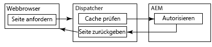
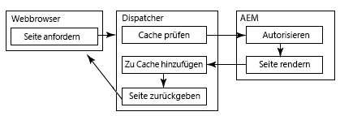
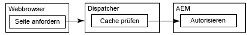

# Zwischenspeichern von geschützten Inhalten {#caching-secured-content}

Mit dem Zwischenspeichern unter Beachtung von Berechtigungen können Sie gesicherte Seiten zwischenspeichern. Der Dispatcher prüft die Zugriffsberechtigungen der Benutzer für eine Seite, bevor die zwischengespeicherte Seite bereitgestellt wird.

Der Dispatcher umfasst das AuthChecker-Modul, das das Zwischenspeichern unter Berücksichtigung von Berechtigungen implementiert. Wenn das Modul aktiviert ist, ruft der Renderer ein AEM-Servlet auf, um die Benutzerauthentifizierung und -autorisierung für die angeforderten Inhalte durchzuführen. Die Servletantwort bestimmt, ob der Inhalt im Webbrowser bereitgestellt wird.

Da die Methoden zur Authentifizierung und Autorisierung spezifisch für die AEM-Bereitstellung sind, müssen Sie das Servlet erstellen.

>[!NOTE]
>
>Verwenden Sie `deny`-Filter, um allgemeine Sicherheitseinschränkungen zu erzwingen. Verwenden Sie die Zwischenspeicherung unter Berücksichtigung von Berechtigungen für Seiten, die zum Zulassen des Zugriffs auf eine Untergruppe von Benutzern oder Gruppen konfiguriert sind.

Die folgenden Abbildungen zeigen die Abfolge der Ereignisse, die auftreten, wenn ein Webbrowser eine Seite anfordert, für die die Zwischenspeicherung unter Berücksichtigung von Berechtigungen verwendet wird.

## Die Seite wurde zwischengespeichert und der Benutzer ist autorisiert  {#page-is-cached-and-user-is-authorized}



1. Der Dispatcher ermittelt, dass der angeforderte Inhalt zwischengespeichert wurde und gültig ist.
1. Der Dispatcher sendet eine Anforderungsnachricht an den Renderer. Der HEAD-Abschnitt enthält alle Kopfzeilen aus der Browseranfrage.
1. Der Renderer ruft die autorisierende Stelle auf, um die Sicherheitsprüfung durchzuführen, und antwortet dem Dispatcher. Die Antwortnachricht enthält den HTTP-Statuscode „200“, um anzuzeigen, dass der Benutzer autorisiert ist.
1. Der Dispatcher sendet eine Antwortnachricht an den Browser, die aus den Kopfzeilen der Rendererantwort und dem zwischengespeicherten Inhalt im Textkörper besteht.

## Die Seite wurde nicht zwischengespeichert und der Benutzer ist autorisiert   {#page-is-not-cached-and-user-is-authorized}



1. Der Dispatcher ermittelt, dass der Inhalt nicht zwischengespeichert wurde oder aktualisiert werden muss.
1. Der Dispatcher leitet die ursprüngliche Anforderung an den Renderer weiter.
1. Der Renderer ruft das Servlet der autorisierenden Stelle auf, um eine Sicherheitsprüfung durchzuführen. Wenn der Benutzer autorisiert ist, schließt der Renderer die gerenderte Seite im Text der Antwortnachricht ein.
1. Der Dispatcher leitet die Antwort an den Browser weiter. Der Dispatcher fügt den Text der Antwortnachricht des Renderers zum Cache hinzu.

## Der Benutzer ist nicht autorisiert   {#user-is-not-authorized}



1. Der Dispatcher überprüft den Cache.
1. Der Dispatcher sendet eine Anfragenachricht an den Renderer, die alle Kopfzeilen der Browseranforderung enthält.
1. Der Renderer ruft das Servlet der autorisierenden Stelle auf, eine Sicherheitsprüfung durchzuführen. Diese führt zu einem Fehler und der Render leitet die ursprüngliche Anforderung an den Dispatcher weiter.

## Implementieren von berechtigungssensitiver Zwischenspeicherung {#implementing-permission-sensitive-caching}

Wenn Sie die Zwischenspeicherung unter Berücksichtigung von Berechtigungen implementieren möchten, führen Sie die folgenden Schritte aus:

* Entwickeln eines Servlets, das die Authentifizierung und Autorisierung ausführt
* Konfigurieren des Dispatchers

>[!NOTE]
>
>In der Regel werden sichere Ressourcen in einem anderen Ordner als nicht sichere Dateien gespeichert. Beispiel: /content/secure/


## Erstellen des Servlets für die Autorisierung   {#create-the-authorization-servlet}

Erstellen Sie ein Servlet, das die Authentifizierung und Autorisierung des Benutzers ausführt, der den Webinhalt anfordert. Stellen Sie das Servlet bereit. Das Servlet kann beliebige Authentifizierungs- und Autorisierungsmethoden verwenden, z. B. das AEM-Benutzerkonto und Repository-ACLs oder einen LDAP-Suchdienst. Das Servlet wird auf der AEM-Instanz bereitgestellt, die der Dispatcher als Renderer verwendet.

Alle Benutzer müssen auf das Servlet zugreifen können. Daher sollte das Servlet die `org.apache.sling.api.servlets.SlingSafeMethodsServlet`-Klasse erweitern, die Lesezugriff auf das System bereitstellt.

Das Servlet empfängt nur HEAD-Anforderungen vom Renderer, Sie müssen daher nur die `doHead`-Methode implementieren.

Der Renderer schließt den URI der angeforderten Ressource als Parameter der HTTP-Anforderung ein. Der Zugriff auf ein Autorisierungsservlet erfolgt z. B. über `/bin/permissioncheck`. Um eine Sicherheitsprüfung auf der Seite „/content/geometrixx-outdoors/en.html“ durchzuführen, schließt der Renderer die folgende URL in die HTTP-Anforderung ein:

`/bin/permissioncheck?uri=/content/geometrixx-outdoors/en.html`

Die Servlet-Antwortnachricht muss die folgenden HTTP-Statuscodes enthalten:

* 200: Authentifizierung und Autorisierung erfolgreich.

Das folgende Beispielservlet ruft die URL der angeforderten Ressource aus der HTTP-Anforderung ab. Der Code verwendet die `Property`-Anmerkung der Felix SCR, um den Wert der `sling.servlet.paths`-Eigenschaft auf „/bin/permissioncheck“ festzulegen. In der `doHead`-Methode ruft das Servlet das Sitzungsobjekt ab und bestimmt mit der `checkPermission`-Methode den entsprechenden Antwortcode.

>[!NOTE]
>
>Der Wert der „sling.servlet.paths“-Eigenschaft muss im Sling Servlet Resolver-Dienst (org.apache.sling.servlets.resolver.SlingServletResolver) aktiviert werden.

### Beispielservlet   {#example-servlet}

```java
package com.adobe.example;

import org.apache.felix.scr.annotations.Component;
import org.apache.felix.scr.annotations.Service;
import org.apache.felix.scr.annotations.Property;

import org.apache.sling.api.SlingHttpServletRequest;
import org.apache.sling.api.SlingHttpServletResponse;
import org.apache.sling.api.servlets.SlingSafeMethodsServlet;

import org.slf4j.Logger;
import org.slf4j.LoggerFactory;

import javax.jcr.Session;

@Component(metatype=false)
@Service
public class AuthcheckerServlet extends SlingSafeMethodsServlet {
 
    @Property(value="/bin/permissioncheck")
    static final String SERVLET_PATH="sling.servlet.paths";
    
    private Logger logger = LoggerFactory.getLogger(this.getClass());
    
    public void doHead(SlingHttpServletRequest request, SlingHttpServletResponse response) {
     try{ 
      //retrieve the requested URL
      String uri = request.getParameter("uri");
      //obtain the session from the request
      Session session = request.getResourceResolver().adaptTo(javax.jcr.Session.class);     
      //perform the permissions check
      try {
       session.checkPermission(uri, Session.ACTION_READ);
       logger.info("authchecker says OK");
       response.setStatus(SlingHttpServletResponse.SC_OK);
      } catch(Exception e) {
       logger.info("authchecker says READ access DENIED!");
       response.setStatus(SlingHttpServletResponse.SC_FORBIDDEN);
      }
     }catch(Exception e){
      logger.error("authchecker servlet exception: " + e.getMessage());
     }
    }
}
```

## Konfigurieren des Dispatchers für die Zwischenspeicherung unter Berücksichtigung von Berechtigungen {#configure-dispatcher-for-permission-sensitive-caching}

Der Abschnitt „auth_checker“ der Datei „dispatcher.any“ steuert das Verhalten beim Zwischenspeichern unter Berücksichtigung von Berechtigungen. Der Abschnitt „auth_checker“ enthält folgende Unterabschnitte:

* `url`: Der Wert der `sling.servlet.paths`-Eigenschaft des Servlets, das die Sicherheitsprüfung ausführt.

* `filter`: Filter zum Angeben der Ordner, auf die das Zwischenspeichern unter Berücksichtigung von Berechtigungen angewendet wird. In der Regel wird ein `deny`-Filter auf alle Ordner angewendet und `allow`-Filter werden auf gesicherte Ordner angewendet.

* `headers`: Gibt die HTTP-Header an, die das Autorisierungsservlet in die Antwort einschließt.

Beim Start des Dispatchers enthält die Dispatcher-Protokolldatei die folgende Nachricht auf Debug-Ebene:

`AuthChecker: initialized with URL 'configured_url'.`

Im folgenden „auth_checker“-Beispielabschnitt wird der Dispatcher für die Verwendung des Servlets aus dem vorherigen Thema konfiguriert. Durch die Angaben im Abschnitt „filter“ werden Berechtigungsprüfungen nur für sichere HTML-Ressourcen durchgeführt.

### Beispielkonfiguration   {#example-configuration}

```xml
/auth_checker
  {
  # request is sent to this URL with '?uri=<page>' appended
  /url "/bin/permissioncheck"
      
  # only the requested pages matching the filter section below are checked,
  # all other pages get delivered unchecked
  /filter
    {
    /0000
      {
      /glob "*"
      /type "deny"
      }
    /0001
      {
      /glob "/content/secure/*.html"
      /type "allow"
      }
    }
  # any header line returned from the auth_checker's HEAD request matching
  # the section below will be returned as well
  /headers
    {
    /0000
      {
      /glob "*"
      /type "deny"
      }
    /0001
      {
      /glob "Set-Cookie:*"
      /type "allow"
      }
    }
  }
```

